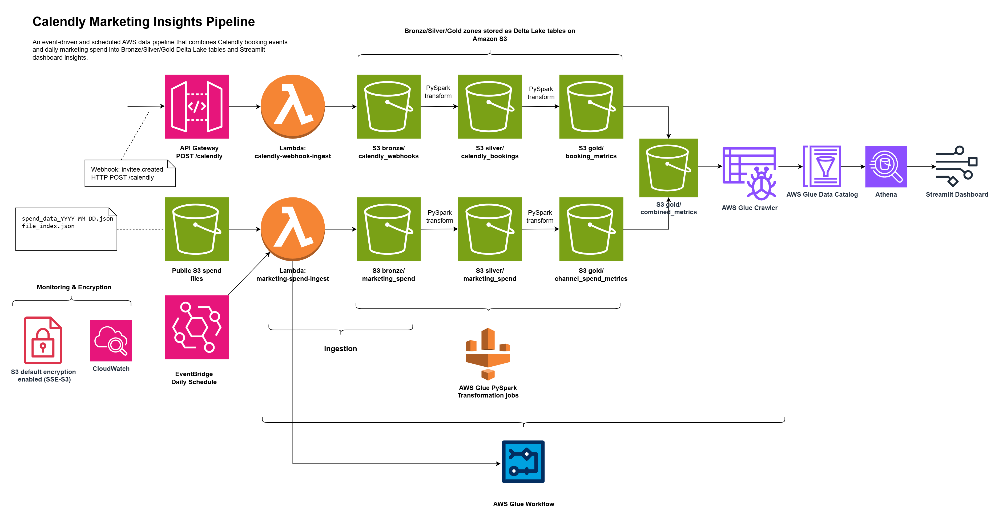
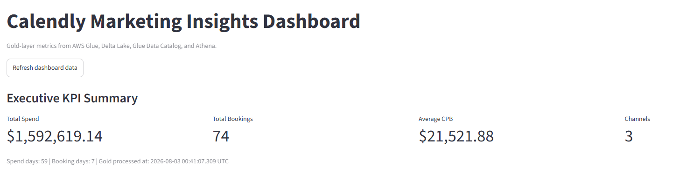
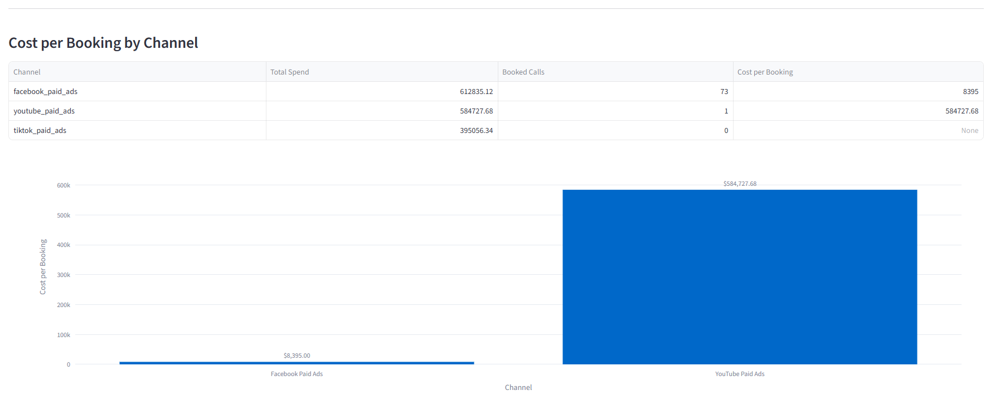
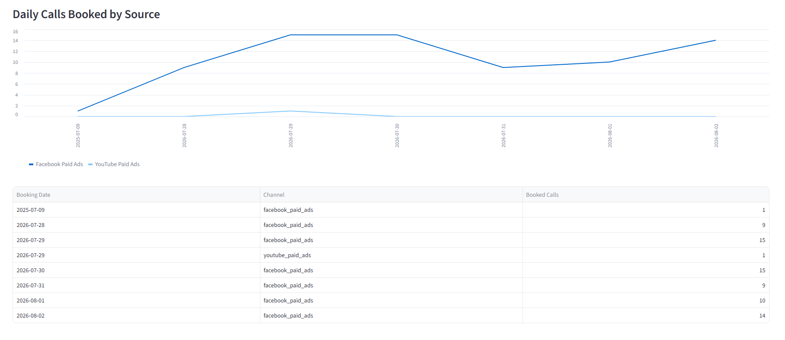
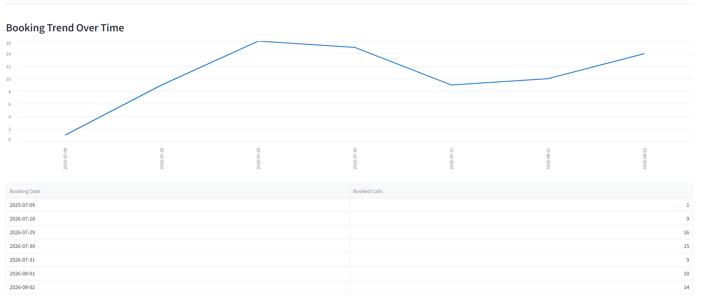
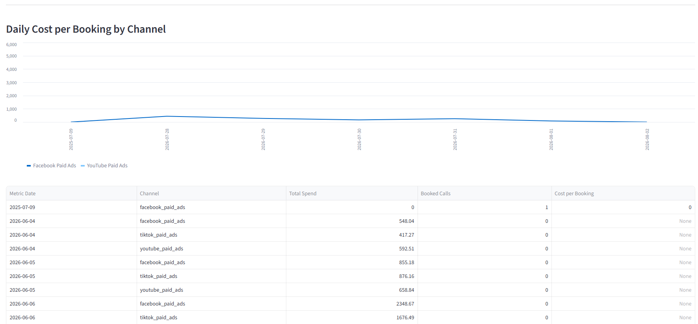
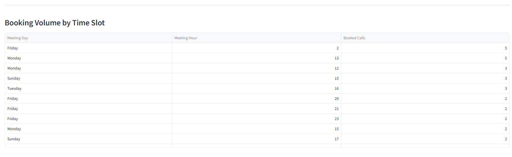
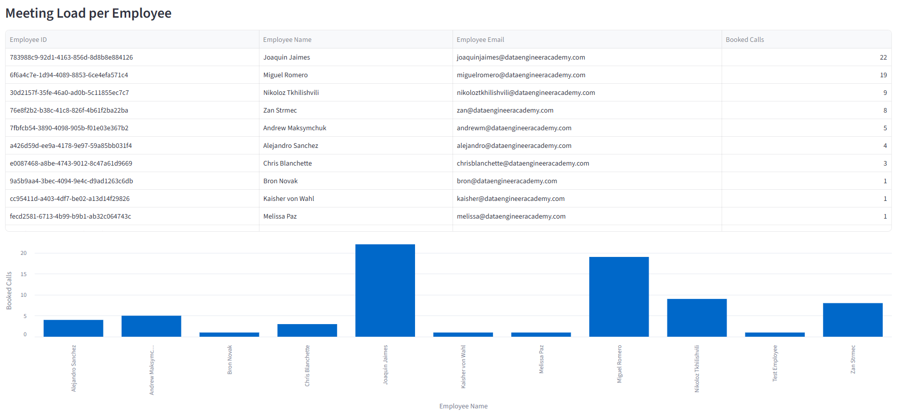

# Calendly Marketing Insights Pipeline

An event-driven and scheduled AWS data pipeline that combines Calendly booking events and daily marketing spend data into Bronze, Silver, and Gold Delta Lake tables on Amazon S3. The Gold layer is registered in the AWS Glue Data Catalog, queried through Athena, and visualized in a deployed Streamlit dashboard.

## Project Overview

This project analyzes paid marketing effectiveness for Calendly booking events. It ingests two source streams:

1. **Calendly webhook events** for `invitee.created` bookings.
2. **Daily marketing spend files** from a public S3 source.

The pipeline transforms the raw data through a Bronze/Silver/Gold lakehouse pattern and produces dashboard-ready metrics such as cost per booking, bookings by source, booking trends, channel attribution, booking volume by time slot, and meeting load by employee.

## Deployed Dashboard

Streamlit dashboard:

```text
https://calendly-marketing-insights-nusqy7exmfb14pouqekqs2.streamlit.app
```

The dashboard reads Gold-layer metrics from Athena, which queries Delta Lake tables registered in the AWS Glue Data Catalog.

## Architecture



[Download the architecture diagram as PDF](docs/architecture/calendly-marketing-insights-architecture.pdf)

The architecture has two ingestion paths:

### Event-driven Calendly ingestion

```text
Calendly Webhook
→ API Gateway POST /calendly
→ calendly-webhook-ingest Lambda
→ S3 Bronze calendly_webhooks
```

Calendly booking events arrive independently whenever an invitee creates a booking. These webhook events are persisted as raw Bronze data in S3.

### Scheduled marketing spend ingestion

```text
EventBridge Scheduler
→ marketing-spend-ingest Lambda
→ Public S3 spend files
→ S3 Bronze marketing_spend
→ AWS Glue Workflow
```

The marketing spend Lambda runs on a daily schedule. It ingests the latest marketing spend file and then starts the main AWS Glue Workflow.

### Transformation and catalog flow

```text
Bronze Delta tables
→ Silver Delta tables
→ Gold Delta tables
→ AWS Glue Crawler
→ AWS Glue Data Catalog
→ Athena
→ Streamlit Dashboard
```

AWS Glue PySpark jobs transform data through the lakehouse layers. A Glue Crawler registers the Gold Delta tables in the Glue Data Catalog so that Athena can query them.

## Video Walkthrough

The walkthrough demonstrates the end-to-end pipeline, including Calendly webhook ingestion, scheduled marketing spend ingestion, AWS Glue transformations, Athena validation, and the Streamlit dashboard.

[Watch the Calendly Marketing Insights walkthrough](docs/videos/calendly-walkthrough.mp4)

## Data Sources

### Calendly webhook events

The project processes Calendly `invitee.created` webhook events. The webhook path receives booking data through API Gateway and stores raw events in S3 Bronze.

Relevant paid ad event types include:

| Channel | Calendly Event Type URI |
|---|---|
| Facebook Paid Ads | `https://api.calendly.com/event_types/d639ecd3-8718-4068-955a-436b10d72c78` |
| YouTube Paid Ads | `https://api.calendly.com/event_types/dbb4ec50-38cd-4bcd-bbff-efb7b5a6f098` |
| TikTok Paid Ads | `https://api.calendly.com/event_types/bb339e98-7a67-4af2-b584-8dbf95564312` |

### Marketing spend files

Marketing spend is read from the public DEA S3 source:

```text
https://dea-data-bucket.s3.us-east-1.amazonaws.com/calendly_spend_data/file_index.json
https://dea-data-bucket.s3.us-east-1.amazonaws.com/calendly_spend_data/spend_data_YYYY-MM-DD.json
```

Each spend record includes:

```text
date
channel
spend
```

## Lakehouse Design

All Bronze, Silver, and Gold datasets are stored as Delta Lake tables on S3.

### Bronze layer

The Bronze layer stores raw source records with ingestion metadata.

```text
s3://calendly-marketing-insights-guy-raw/bronze/calendly_webhooks/
s3://calendly-marketing-insights-guy-raw/bronze/marketing_spend/
```

### Silver layer

The Silver layer stores cleaned, validated, flattened records.

```text
s3://calendly-marketing-insights-guy-raw/silver/calendly_bookings/
s3://calendly-marketing-insights-guy-raw/silver/marketing_spend/
```

### Gold layer

The Gold layer stores dashboard-ready business metrics.

```text
s3://calendly-marketing-insights-guy-raw/gold/daily_spend_by_channel/
s3://calendly-marketing-insights-guy-raw/gold/channel_spend_summary/
s3://calendly-marketing-insights-guy-raw/gold/daily_calls_by_source/
s3://calendly-marketing-insights-guy-raw/gold/booking_trends/
s3://calendly-marketing-insights-guy-raw/gold/channel_attribution/
s3://calendly-marketing-insights-guy-raw/gold/booking_volume_by_time_slot/
s3://calendly-marketing-insights-guy-raw/gold/employee_meeting_load/
s3://calendly-marketing-insights-guy-raw/gold/booking_dashboard_kpis/
s3://calendly-marketing-insights-guy-raw/gold/cpb_by_channel/
s3://calendly-marketing-insights-guy-raw/gold/daily_cpb_by_channel/
s3://calendly-marketing-insights-guy-raw/gold/combined_dashboard_kpis/
```

## Gold Metrics

The dashboard uses the following Gold tables:

| Gold Table | Purpose |
|---|---|
| `combined_dashboard_kpis` | Executive KPI summary: total spend, total bookings, average CPB, channel count |
| `cpb_by_channel` | Cost per booking by paid ad channel |
| `daily_cpb_by_channel` | Daily cost per booking by channel |
| `daily_calls_by_source` | Daily booked calls by marketing source |
| `booking_trends` | Booking trend over time |
| `channel_attribution` | Booking volume by channel and UTM campaign |
| `booking_volume_by_time_slot` | Bookings by day of week and meeting hour |
| `employee_meeting_load` | Booked calls assigned to each employee |
| `daily_spend_by_channel` | Daily marketing spend by channel |
| `channel_spend_summary` | Spend summary by channel |
| `booking_dashboard_kpis` | Booking-only KPI summary |

## AWS Resources

### S3

Primary project bucket:

```text
calendly-marketing-insights-guy-raw
```

Important prefixes:

```text
bronze/
silver/
gold/
scripts/glue_jobs/
athena-results/
```

Security configuration:

```text
S3 Block Public Access: enabled
Default encryption: SSE-S3
```

### IAM Roles

- **Lambda execution role** (`calendly-webhook-lambda-role`): used by the webhook and marketing spend ingestion Lambda functions. Allows Lambda to write Bronze records to S3, write logs to CloudWatch, and start the Glue Workflow.
- **EventBridge Scheduler role** (`calendly-marketing-spend-scheduler-role`): allows the daily EventBridge Scheduler to invoke the marketing spend ingestion Lambda.
- **Glue service role** (`calendly-marketing-insights-glue-role`): used by Glue jobs and the Glue Crawler to read/write S3 Delta tables, access Glue scripts, write logs, and update the Glue Data Catalog.

### Lambda

| Lambda Function | Purpose |
|---|---|
| `calendly-webhook-ingest` | Receives Calendly webhook events from API Gateway and writes Bronze webhook JSON to S3 |
| `marketing-spend-ingest` | Reads daily marketing spend files from public S3, writes Bronze spend data to S3, and starts the Glue Workflow |

### API Gateway

```text
POST /calendly
```

The API Gateway endpoint receives Calendly webhook events and invokes the `calendly-webhook-ingest` Lambda.

### EventBridge Scheduler

```text
calendly-marketing-spend-daily
```

The schedule invokes the marketing spend ingestion Lambda daily. The spend Lambda then starts the Glue Workflow after ingestion logic completes.

### AWS Glue Jobs

Bronze to Silver jobs:

```text
calendly-bronze-to-silver-spend
calendly-bronze-to-silver-bookings
```

Silver to Gold jobs:

```text
calendly-silver-to-gold-spend
calendly-silver-to-gold-bookings
calendly-silver-to-gold-combined
```

### AWS Glue Workflow

```text
calendly-marketing-insights-workflow
```

Workflow sequence:

```text
start-calendly-pipeline
  ├── calendly-bronze-to-silver-spend
  │     └── calendly-silver-to-gold-spend
  │
  └── calendly-bronze-to-silver-bookings
        └── calendly-silver-to-gold-bookings

After both Gold tracks complete:
  └── calendly-silver-to-gold-combined
        └── calendly-marketing-crawler
```

### AWS Glue Crawler

```text
calendly-marketing-crawler
```

The crawler registers the Gold Delta tables in the Glue Data Catalog.

### Glue Database

```text
calendly_marketing_insights
```

### Athena

Athena queries the Gold Delta tables registered in the Glue Data Catalog.

Athena query output location:

```text
s3://calendly-marketing-insights-guy-raw/athena-results/
```

## Repository Structure

```text
.
├── dashboard/
│   └── app.py
├── sample_data/
│   ├── calendly_invitee_created_sample.json
│   └── spend_data_sample.json
├── src/
│   ├── glue_jobs/
│   │   ├── bronze_to_silver_calendly_glue.py
│   │   ├── bronze_to_silver_spend_glue.py
│   │   ├── silver_to_gold_bookings_glue.py
│   │   ├── silver_to_gold_combined_glue.py
│   │   └── silver_to_gold_spend_glue.py
│   ├── lambda_marketing_spend_ingest/
│   │   └── app.py
│   ├── lambda_webhook_receiver/
│   │   └── app.py
│   ├── metrics/
│   ├── parsers/
│   ├── pipelines/
│   ├── shared/
│   └── transforms/
├── tests/
├── requirements.txt
└── README.md
```

## Local Development Setup

Create and activate a Python virtual environment:

```bash
python3.12 -m venv py3_12
source py3_12/bin/activate
pip install --upgrade pip
pip install -r requirements.txt
```

## Running Tests

Run the full test suite:

```bash
unset SPARK_HOME
pytest
```

Expected result:

```text
155 passed
```

### Local PySpark troubleshooting

If local PySpark tests fail with an error similar to:

```text
Py4JException: Constructor org.apache.spark.sql.SparkSession(...) does not exist
```

unset the global Spark installation before running tests:

```bash
unset SPARK_HOME
pytest
```

This prevents the local test suite from mixing the virtual environment's PySpark package with a different globally installed Spark runtime.

## Running the Streamlit Dashboard Locally

The dashboard reads Gold-layer metrics from Athena.

Set the AWS profile used for local development:

```bash
export AWS_PROFILE=healthcare-dev
export AWS_DEFAULT_REGION=us-east-2
streamlit run dashboard/app.py
```

The local IAM user/profile needs permissions for Athena queries, Glue Data Catalog read access, and S3 access to the Athena results location.

## Streamlit Community Cloud Deployment

The deployed dashboard uses Streamlit Community Cloud secrets for AWS access and Athena configuration.

Required Streamlit secrets:

```toml
AWS_ACCESS_KEY_ID = "<streamlit-dashboard-access-key>"
AWS_SECRET_ACCESS_KEY = "<streamlit-dashboard-secret-key>"
AWS_DEFAULT_REGION = "us-east-2"

ATHENA_DATABASE_NAME = "calendly_marketing_insights"
ATHENA_OUTPUT_LOCATION = "s3://calendly-marketing-insights-guy-raw/athena-results/"
```

Do not commit AWS credentials or local secrets files to GitHub.

## Validation

The pipeline was validated through:

1. Local unit and integration tests.
2. Manual Lambda invocations.
3. Successful Glue Workflow runs.
4. Successful Glue Crawler execution.
5. Athena SQL validation queries against Gold tables.
6. Streamlit dashboard deployment and visual inspection.

Example workflow validation:

```text
Status: COMPLETED
TotalActions: 6
SucceededActions: 6
FailedActions: 0
ErroredActions: 0
```

Example dashboard KPI output:

```text
Total Spend:    $1,592,619.14
Total Bookings: 74
Average CPB:    $21,521.88
Channels:       3
```

## Dashboard Screenshots

### Executive KPI Summary



### Cost per Booking by Channel



### Daily Calls Booked by Source



### Booking Trend Over Time



### Daily Cost per Booking by Channel



### Booking Volume by Time Slot



### Employee Meeting Load



## Security Notes

- S3 Block Public Access is enabled.
- S3 default server-side encryption is enabled using SSE-S3.
- AWS credentials are not committed to the repository.
- Streamlit Community Cloud credentials are stored in app secrets.
- The dashboard queries Athena through an IAM user with limited Athena, Glue read, and S3 access.

## Final Deliverables

- Source code for Lambda functions, parsers, transforms, Glue jobs, tests, and Streamlit dashboard.
- AWS architecture diagram.
- Deployed Streamlit dashboard.
- Glue Workflow and Crawler-based catalog refresh.
- Athena-queryable Gold Delta tables.
- README documentation.
- Video walkthrough.
